# speed-math
Game for doing basic speed math

## Motivation
This game is designed for players who want to keep their mind sharp by doing basic math within a limit time. This project is built when I was in University. At that time, I was inspired by the game 2048, as it is a simple game but brings me lots of fun when I had nothing to do. Therefore, I was trying to build a game that requires player to think while providing certain degree of excitement. Unfortunately, the result of the prototype does not reach to my friends expectation and even my expectation for a quality game. Therefore, the development for this game is supspended. 

## Description
Currently, the game provides basic functionality, such as moving the number, combine the number with different operators, gameover check, random change math operator and specific number target for player to get higher score. For future development, the game could add more ways to gain higher score, as currently the game allow only moving one steps each turn. However, it does not encourage player to do more calculations. It is therefore, penalty or bonus for doing less move or do more moves could be added in each turn, so that the player could have more challenge when playing the game.

## Game Shots

Main Page

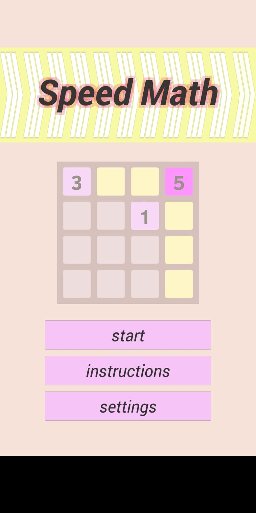

Game Page
| No Click | Clicked |
|:---:|:---:|
|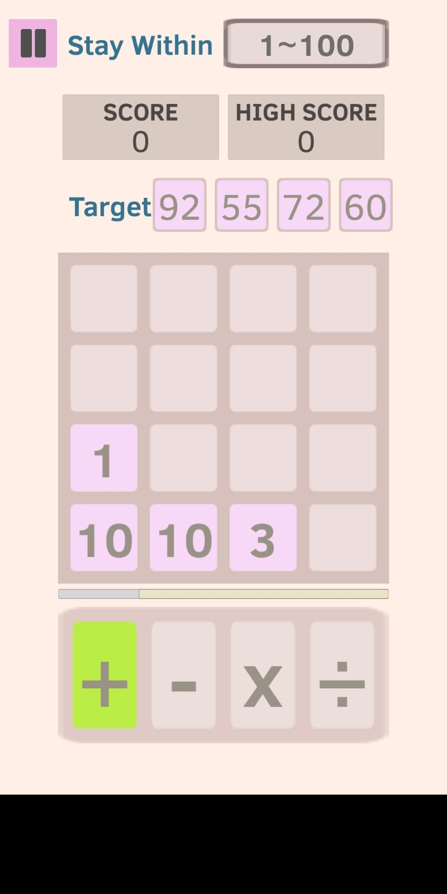|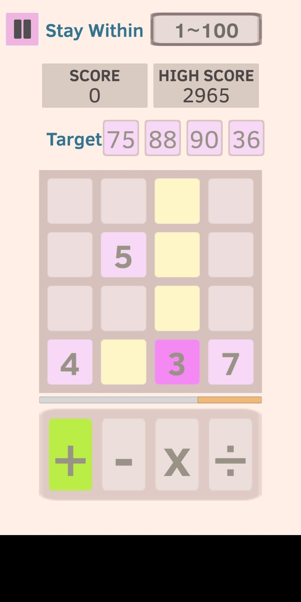|

## Game Instructions

When the game start, it will spawn different number to any tiles within a 4x4 grid

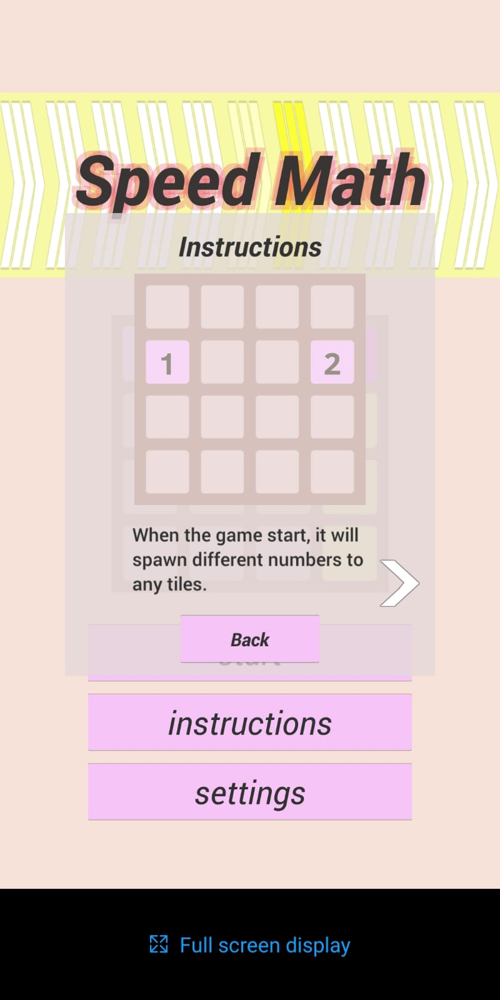

Choose a number you want to move

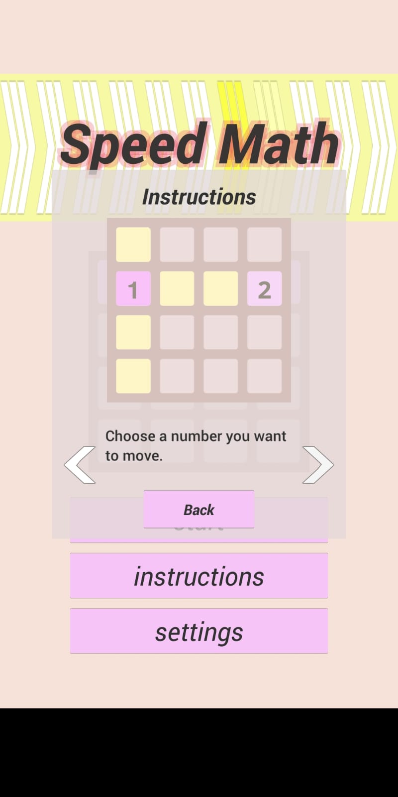

You can either:
|Move the number |Combine to other number|
|:---:|:---:|
|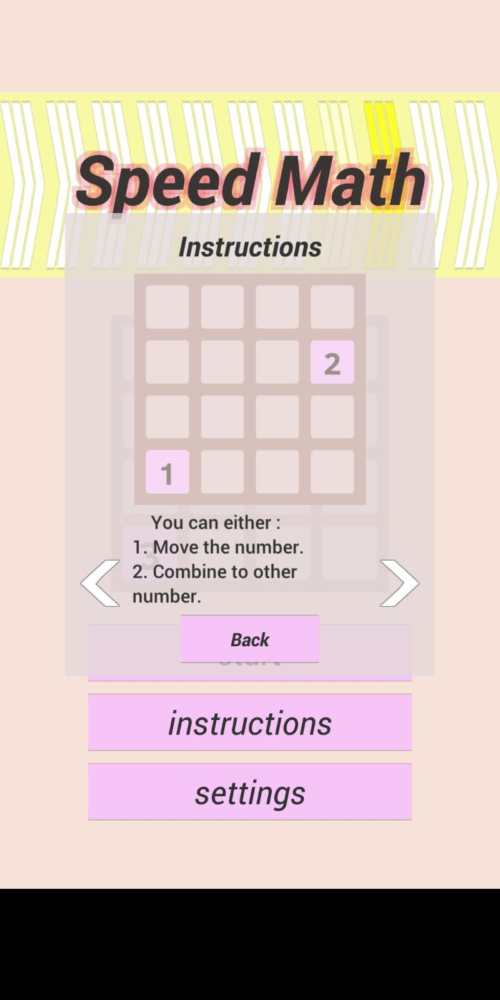|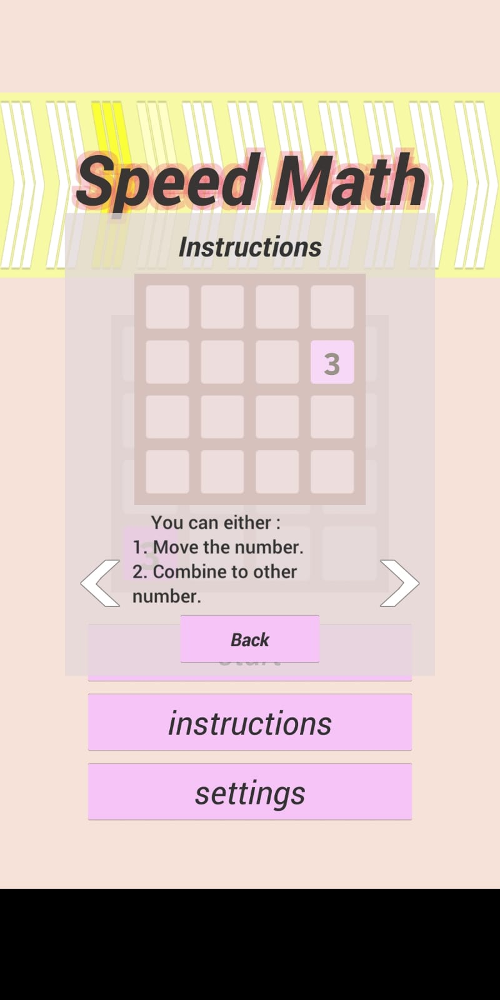|

When the timer counts to zero, the basic math operator will change
|Before Count Down |After Count Down|
|:---:|:---:|
|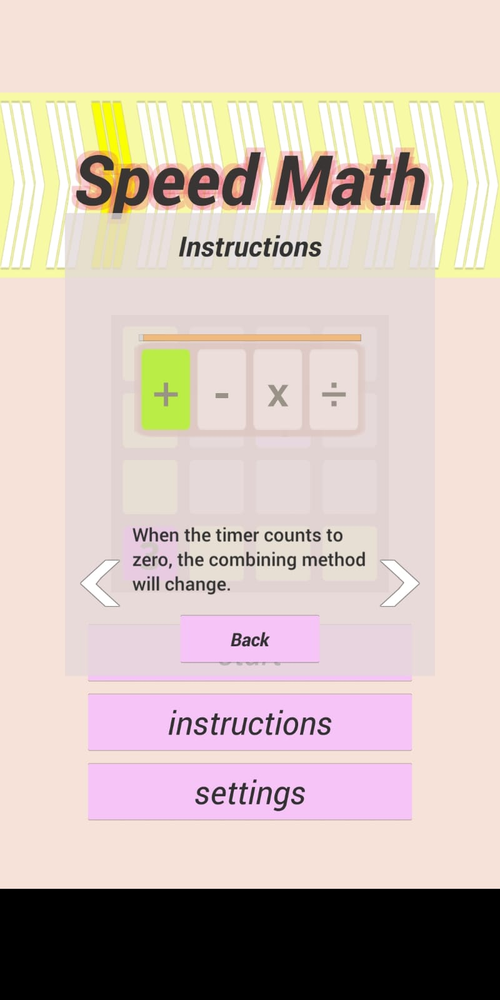|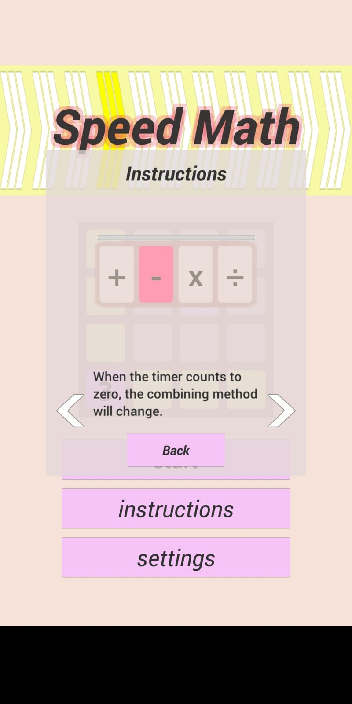|

You must at least combine ONE number before the timer counts to zero
|Before Count Down |After Count Down|
|:---:|:---:|
|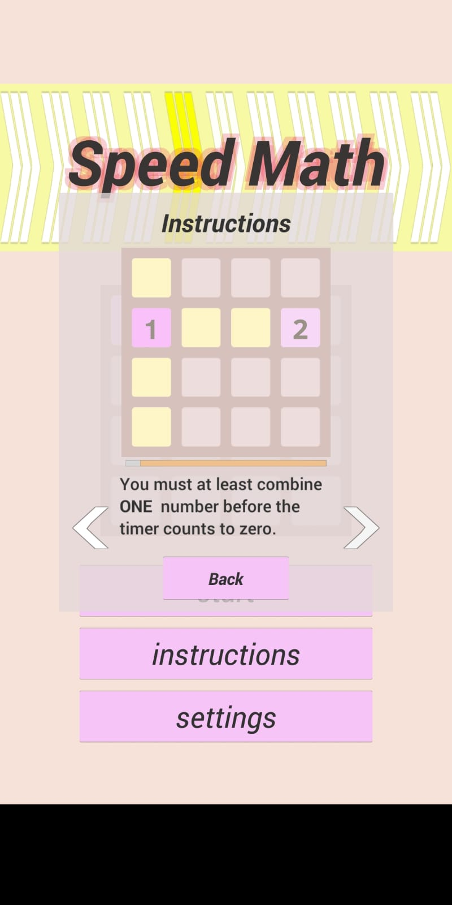|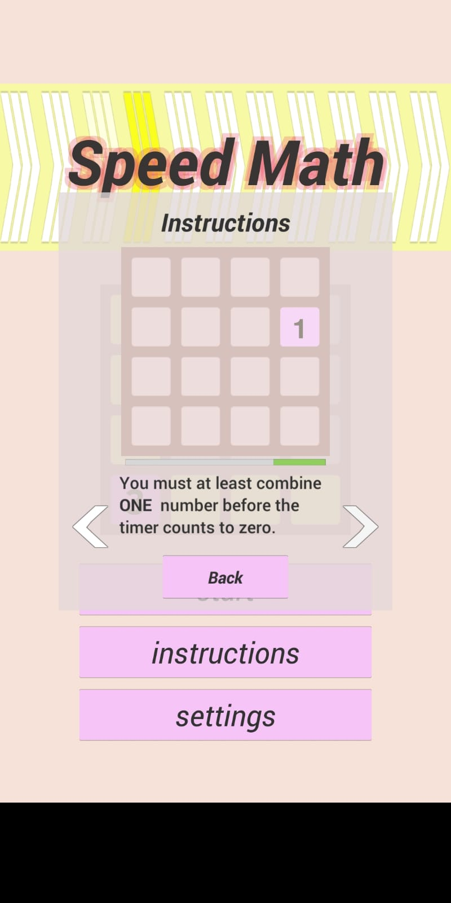|

Stay within 1 to 100, else the number will stuck in that tile
|Before Move |After Move|
|:---:|:---:|
|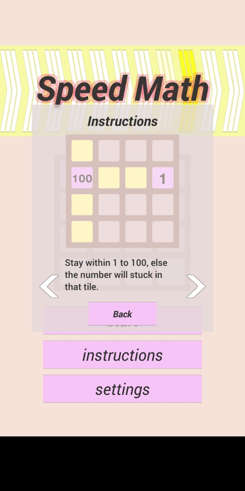|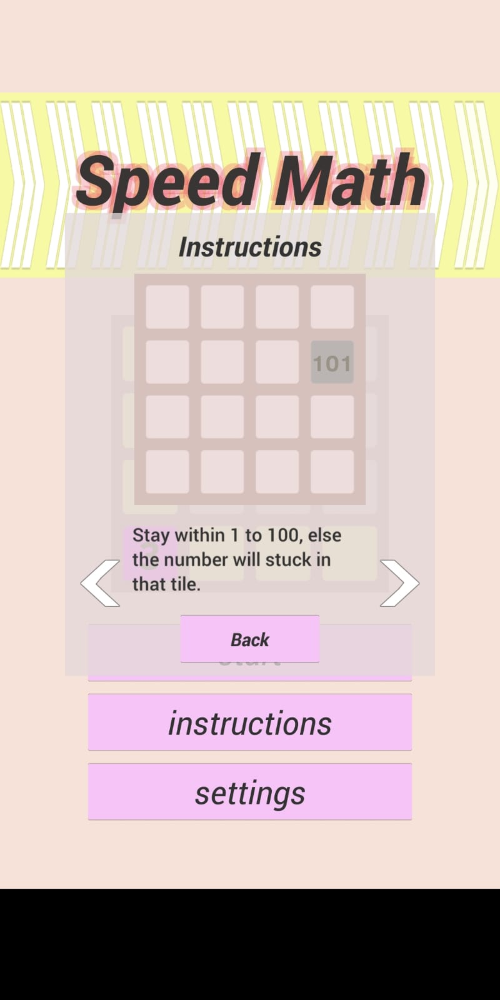|

 ## Development Tools / Languages
 - Unity 5.5.4p4
 - All the scripts are write in C#
 ## License
 MPL © EddyLau
